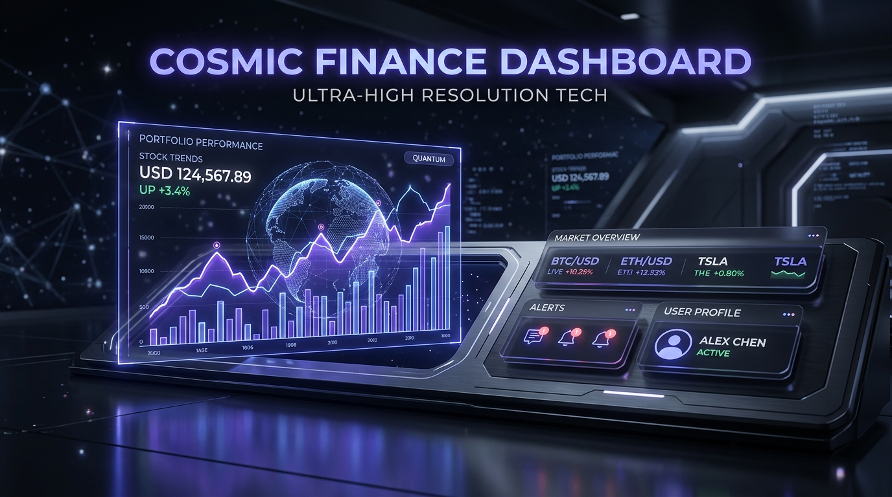
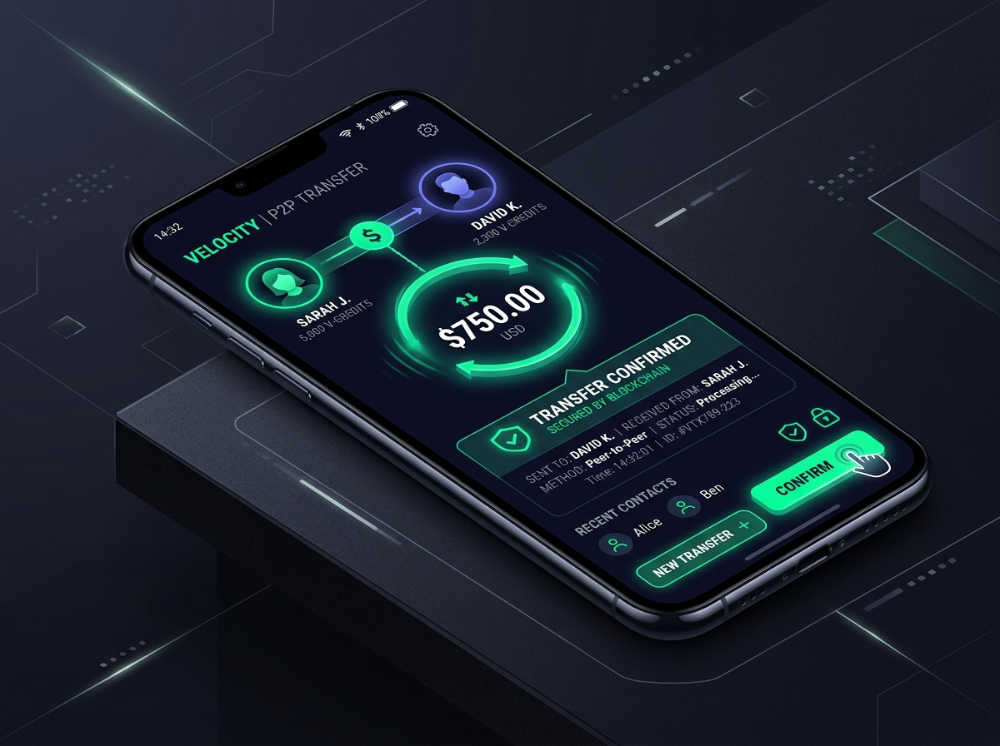

# 🌌 Sheikh Code Exchange (শেখ কোড এক্সচেঞ্জ)
একটি ইন্টারেক্টিভ টেলিক্রাম ওয়ালেট ট্রান্সফার সিমুলেটর, ডেভেলপমেন্ট পেমেন্ট ব্রিজ এবং রিয়েল-টাইম অডিট লগিং কনসোল। এটি চমৎকার **"Cosmic Slate"** ডার্ক থিম নান্দনিকতায় মোড়ানো এবং অত্যন্ত রেসপন্সিভ মোবাইল ফ্রেন্ডলি ডিজাইনে তৈরি।



---

## 🚀 পরিচিতি (Introduction)
**Sheikh Code Exchange** হলো একটি অত্যাধুনিক ইন্টারেক্টিভ সিমুলেটর প্ল্যাটফর্ম, যা মূলত টেলিক্রাম ওয়ালেট (Telegram Wallet) ও পেমেন্ট গেটওয়ে ইন্টারফেসের জন্য তৈরি। এটি ডেভেলপার এবং গ্রাহকদের একটি বাস্তবসম্মত পরিবেশে পেমেন্ট ট্র্যাকিং, ব্যবহারকারী সনাক্তকরণ, পি-টু-পি (P2P) ট্রান্সফার, রিয়েল-টাইম ওয়েব হুক ট্রিগার এবং অডিট ট্রেইল বিশ্লেষণের সুবিধা দেয়। 

---

## 🎨 ডিজাইন ফিলোসফি: কসমিক স্লেট (Cosmic Slate Aesthetic)
এই অ্যাপ্লিকেশনটি **Cosmic Slate Theme** দ্বারা চালিত:
* **ডার্ক থিম এক্সিলেন্স:** নিখুঁত ডার্ক ব্যাকগ্রাউন্ডের সাথে উজ্জ্বল নীল, ভায়োলেট ও পান্না সবুজ (Emerald Green) কালার এক্সেন্টের নিখুঁত সংমিশ্রণ।
* **মোবাইল-বান্ধব ও রেসপন্সিভ:** স্ক্রিনের আকার অনুযায়ী স্বয়ংক্রিয়ভাবে গ্রিড কলাম ও ট্যাব বিন্যাস সামঞ্জস্য করে, ফলে মোবাইলেও স্ক্রিন কাটছাঁট হওয়া ছাড়াই অনায়াসে ব্যবহার করা যায়।
* **ডাইনামিক স্ট্যাটাস:** কনসোলে রিয়েল-টাইম প্রসেসিং ট্র্যাকিংয়ের জন্য পালসিং অ্যানিমেশন সংবলিত **Active/Idle** ইন্ডিকেটর যুক্ত।
* **অ্যানিমেশন:** `motion/react` লাইব্রেরির মাধ্যমে মসৃণ ইন্টারেকশন ও ট্রানজিশন ইফেক্ট।

---

## 🛠️ মূল ফিচারসমূহ (Core Features)

### ১. ফিউশনপে গেটওয়ে কনসোল (FusionPay Console)
* **স্যান্ডবক্স সিমুলেশন (Sandbox Environment):** রিয়েল-টাইম ওয়ালেট ব্যালেন্স পাঠানো ও ব্যবহারকারী যুক্তকরণের ডাইনামিক ফিল্ড।
* **ডাইনামিক ওয়েব হুক ক্লায়েন্ট (Active Webhook Target):** একক ক্লিকে যেকোনো ওয়েব হুক এন্ডপয়েন্ট যুক্ত করার এবং রেসপন্স কোডসহ (যেমন: `200 OK`, `400 Bad Request`, `500 Server Error`) লাইভ পরীক্ষা করার সুবিধা।
* **অ্যাকশন-ভিত্তিক লোডিং উইজেট:** বাটনগুলোতে লাইভ স্পিনার অ্যানিমেশন যা যেকোনো অ্যাকশন প্রসেসিংয়ের সময় ডাইনামিক ফিডব্যাক দেয়।
* **কানেকশন লগ ট্রেইল (Connection Logs):** সুন্দর কোলা্যাপসিবল ইন্টারফেসের মাধ্যমে পূর্ববর্তী সবকটি এপিআই কল ও ওয়েব হুক রিকোয়েস্ট-রেসপন্স বডি সরাসরি দেখার ব্যবস্থা।

<p align="center">
  
</p>

### ২. ডেটা এনরিচমেন্ট পোর্টাল (Data Enrichment Portal)
* **গুগল ড্রাইভ ব্যাকআপ (Google Drive Backup):** ইউজারের অ্যাক্টিভিটি রিপোর্ট সরাসরি গুগল ড্রাইভে ব্যাকআপ রাখার ব্যবস্থা।
* **পিডিএফ জেনারেটর (PDF Document Generator):** `jspdf` ব্যবহার করে চমৎকার প্রফেশনাল অডিট রিপোর্ট ও মানি রিসিট পিডিএফ ফরম্যাটে ডাউনলোড করার সুবিধা।
* **আর্টিফিশিয়াল ইন্টেলিজেন্স (Google Gemini SDK):** জেনারেটিভ এআই এর মাধ্যমে যেকোনো পেমেন্ট ও ইউজার অ্যাক্টিভিটির সংক্ষিপ্ত বিবরণ এবং অডিট এনালাইসিস।

---

## 💻 টেকনোলজি স্ট্যাক (Tech Stack)

| প্রযুক্তি | বিবরণ |
| :--- | :--- |
| **React 19 & TypeScript** | অ্যাপ্লিকেশন লজিক ও টাইপ-সেফটি ম্যানেজমেন্টের জন্য। |
| **Vite 6** | সুপার-ফাস্ট বান্ডলার ও ডেভলপমেন্ট সার্ভার। |
| **Tailwind CSS 4** | কসমিক স্লেট নান্দনিকতার সম্পূর্ণ ইউটিলিটি-ভিত্তিক স্টাইলিংয়ের জন্য। |
| **Firebase SDK** | ব্যাকএন্ড ডাটাবেজ ও ইউজার অথেনটিকেশন। |
| **@google/genai** | গুগল জেমিনি এআই চালিত ডেটা এনরিচমেন্ট। |
| **jsPDF** | ডাইনামিক ক্লায়েন্ট-সাইড পিডিএফ জেনারেশন। |
| **lucide-react** | সম্পূর্ণ অ্যাপ্লিকেশনের ভেক্টর আইকন সমাহার। |

---

## 📂 প্রজেক্ট ফোল্ডার স্ট্রাকচার (Folder Structure)

```bash
├── src/
│   ├── App.tsx                    # প্রধান অ্যাপ্লিকেশন শেল ও ইন্টারফেস লেআউট
│   ├── auth.ts                    # ফায়ারবেস অথেনটিকেশন কনফিগারেশন
│   ├── drive.ts                   # গুগল ড্রাইভ ব্যাকআপ ইন্টিগ্রেশন লজিক
│   ├── pdfGenerator.ts            # পিডিএফ ফাইল জেনারেশন ইঞ্জিন
│   ├── index.css                  # গ্লোবাল স্টাইল ও কসমিক থিম ভেরিয়েবলস
│   ├── main.tsx                   # রিঅ্যাক্ট মাউন্ট পয়েন্ট
│   └── components/
│       ├── FusionPayConsole.tsx   # ফিউশনপে মূল ইন্টারেক্টিভ সিমুলেটর
│       └── DataEnrichmentPortal.tsx # গুগল ড্রাইভ ব্যাকআপ ও এআই অডিট হাব
├── metadata.json                  # অ্যাপ মেটাডেটা ও পারমিশন কনফিগারেশন
├── package.json                   # প্রজেক্ট ডিপেন্ডেন্সি ও স্ক্রিপ্টসমূহ
└── tsconfig.json                  # টাইপস্ক্রিপ্ট কম্পাইলার কনফিগারেশন
```

---

## 🚀 লোকাল সেটআপ গাইড (How to Run Locally)

লোকাল কম্পিউটারে প্রজেক্টটি চালু করতে নিচের ধাপগুলো অনুসরণ করুন:

### ১. ক্লোন ও ডিরেক্টরিতে প্রবেশ করুন
```bash
git clone <repository-url>
cd sheikh-code-exchange
```

### ২. ডিপেন্ডেন্সি ইনস্টল করুন
```bash
npm install
```

### ৩. এনভায়রনমেন্ট ভেরিয়েবল সেটআপ করুন
মূল ডিরেক্টরিতে একটি `.env` ফাইল তৈরি করুন এবং আপনার প্রয়োজনীয় ক্রেডেন্সিয়ালস যোগ করুন (উদাহরণস্বরূপ `.env.example` দেখুন):
```env
GEMINI_API_KEY=your_gemini_api_key_here
```

### ৪. ডেভেলপমেন্ট সার্ভার রান করুন
```bash
npm run dev
```
সার্ভারটি সাধারণত আপনার লোকালহোস্টের `http://localhost:3000` এ সচল হবে।

### ৫. প্রজেক্ট বিল্ড ও রান (Production)
```bash
npm run build
npm run preview
```

---

## 📌 অবদান গাইডলাইন (Contribution Guidelines)
* আপনি যদি নতুন কোনো ফিচার যোগ করতে চান তবে প্রথমে অ্যাপ্লিকেশনটির রেসপন্সিভনেস নিশ্চিত করুন।
* কোনো নতুন কালার ব্যবহারের ক্ষেত্রে কসমিক স্লেট ডার্ক থিমের প্যালেটের সামঞ্জস্য বজায় রাখুন।
* কোড পুশ করার পূর্বে সবসময় `npm run lint` চালিয়ে টাইপ চেকিং এবং সিনট্যাক্স এরর চেক করে নিন।

---

🎨 **ডিজাইন ও ডেভেলপমেন্ট:** গুগল এআই স্টুডিও বিল্ডার্স প্ল্যাটফর্মে অত্যন্ত যত্নের সাথে শেখ কোড এক্সচেঞ্জ উন্নত করা হয়েছে। আপনার কোনো প্রশ্ন বা পরামর্শ থাকলে আমাদের ইমেইল করতে পারেন।
